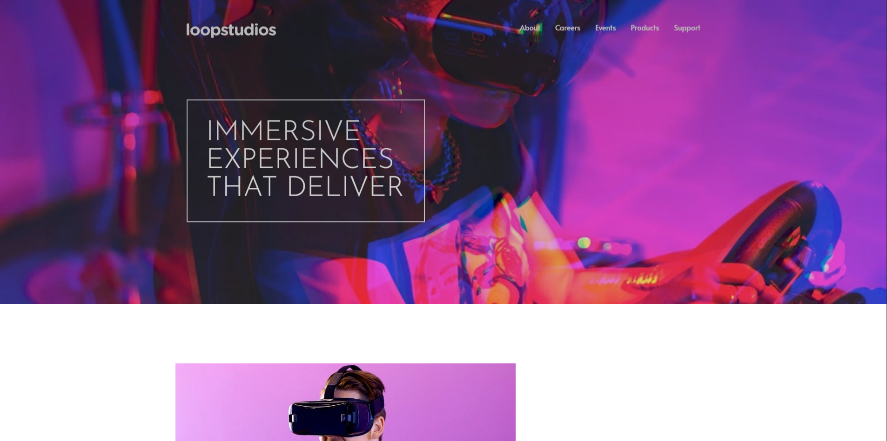

# Frontend Mentor - Loopstudios Landing Page Solution

This is a solution to the [Loopstudios landing page challenge on Frontend Mentor](https://www.frontendmentor.io/challenges/loopstudios-landing-page-N88J5Onjw). Frontend Mentor challenges help you improve your coding skills by building realistic projects.

## Table of Contents

- [Overview](#overview)
  - [The Challenge](#the-challenge)
  - [Screenshot](#screenshot)
  - [Links](#links)
- [My Process](#my-process)
  - [Built With](#built-with)
  - [Features](#features)
  - [What I Learned](#what-i-learned)
- [Author](#author)

## Overview

### The Challenge

Users should be able to:

- View the optimal layout for the site depending on their device's screen size
- See hover states for all interactive elements on the page
- Navigate through a fully accessible mobile menu
- Experience smooth animations and transitions

### Screenshot



### Links

- Solution URL: [My solution on frontend mentor](https://www.frontendmentor.io/solutions/loopstudios-landing-page-with-tailwindcss-and-advanced-animations-c3_BBfDGRg)
- Live Site URL: [live site](https://qs3h.github.io/Loopstudios-landing-page/)

## My Process

### Built With

- Semantic HTML5 markup
- CSS custom properties
- Flexbox
- CSS Grid
- Mobile-first workflow
- [Tailwind CSS](https://tailwindcss.com/) - For styles
- Vanilla JavaScript - For enhanced interactions

### Features

1. **Enhanced Mobile Menu:**

   - Smooth slide-in/out animations
   - Backdrop overlay with blur effect
   - Close button with rotation animation
   - Proper spacing and alignment
   - Focus management for accessibility

2. **Accessibility Features:**

   - ARIA roles and labels
   - Keyboard navigation support
   - Focus trapping in mobile menu
   - Skip to main content link
   - Semantic HTML structure

3. **Interactive Elements:**

   - Hover effects on navigation items
   - Scale and transform animations on cards
   - Dynamic button states
   - Smooth transitions

4. **Performance Optimizations:**
   - Lazy loading of images
   - Optimized image assets
   - Smooth scrolling behavior
   - Efficient CSS animations

### What I Learned

Throughout this project, I gained valuable experience in:

- Implementing accessible navigation patterns
- Creating smooth animations with CSS transitions
- Managing focus states for better accessibility
- Using Tailwind CSS for responsive design
- Handling mobile menu interactions
- Implementing parallax scrolling effects
- Creating reusable animation components

Some key code snippets that demonstrate these learnings:

```javascript
// Focus trap implementation
function trapFocus() {
  const focusableElements = menu.querySelectorAll(
    'a[href], button, textarea, input[type="text"], input[type="radio"], input[type="checkbox"], select'
  );
  const firstFocusableElement = focusableElements[0];
  const lastFocusableElement = focusableElements[focusableElements.length - 1];
  // ... focus management code
}
```

```css
/* Enhanced mobile menu animations */
.mobile-menu {
  transform: translateX(-100%);
  transition: transform 0.3s ease-in-out, opacity 0.3s ease-in-out;
}

.mobile-menu.active {
  transform: translateX(0);
  opacity: 1;
}
```

## Author

- Frontend Mentor - [@QS3H](https://www.frontendmentor.io/profile/QS3H)
- GitHub - [QS3H](https://github.com/QS3H)

## Acknowledgments

Thanks to Frontend Mentor for providing this challenge and to the community for their valuable feedback and support.
